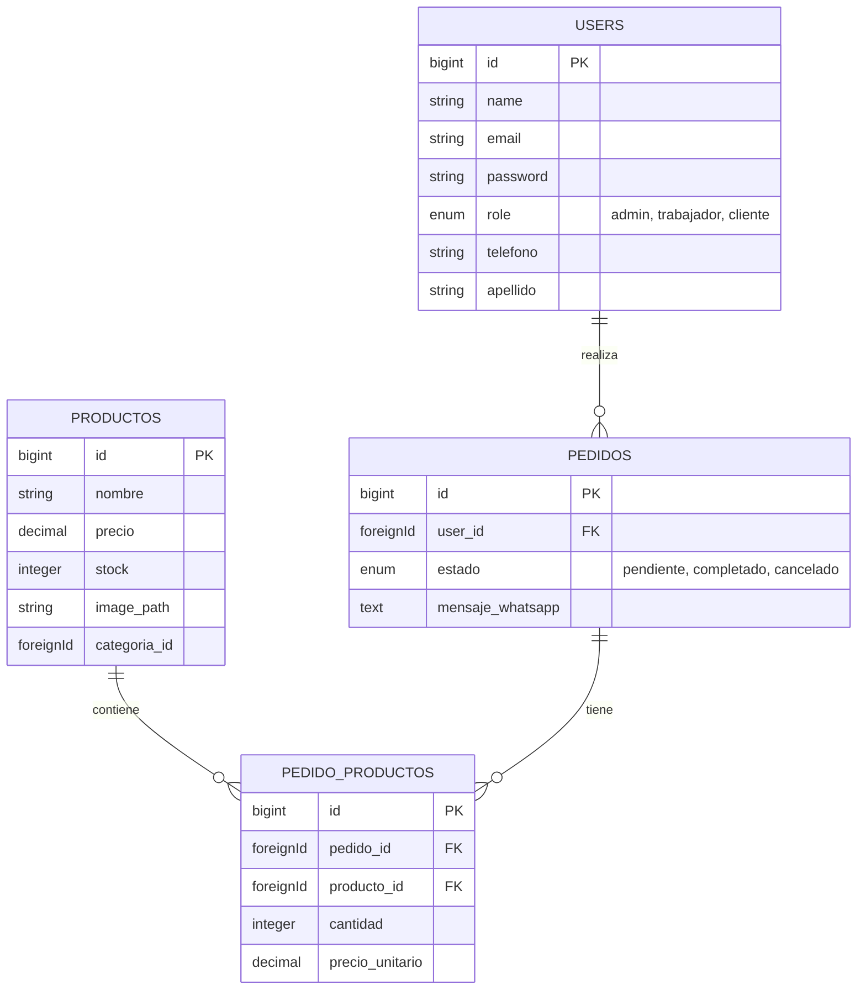

# 📂 Documentación Técnica del Proyecto (Handover)

Este documento resume la estructura técnica, base de datos y lógica principal del sistema de Distribuidora para facilitar el traspaso o colaboración.

## 1. Estructura de Base de Datos (Entity-Relationship)



## 2. Migraciones Clave

### Tabla `users` (Con soporte de roles)
```php
// database/migrations/xxxx_xx_xx_create_users_table.php
Schema::create('users', function (Blueprint $table) {
    $table->id();
    $table->string('name'); // Nombre
    $table->string('apellido')->nullable();
    $table->string('email')->unique();
    $table->string('password');
    $table->enum('role', ['cliente', 'trabajador', 'administrador'])->default('cliente');
    $table->string('telefono')->nullable();
    $table->timestamps();
});
```

### Tabla `pedidos` (Gestión de estados)
```php
// database/migrations/xxxx_xx_xx_create_pedidos_table.php
Schema::create('pedidos', function (Blueprint $table) {
    $table->id();
    $table->foreignId('user_id')->constrained()->onDelete('cascade');
    $table->enum('estado', ['pendiente', 'confirmado', 'completado', 'cancelado'])->default('pendiente');
    $table->text('mensaje_whatsapp')->nullable(); // Guardamos el link generado
    $table->text('detalle_pedido')->nullable();   // Copia estática del pedido
    $table->timestamps();
});
```

## 3. Modelos y Lógica de Negocio

### Modelo `User` (Manejo de Roles)
La lógica de roles utiliza métodos *helper* para evitar comparar strings en toda la aplicación. Se definen en `App\Models\User`.

```php
// app/Models/User.php

public function isAdministrador(): bool {
    return $this->role === 'administrador';
}

public function isTrabajador(): bool {
    return $this->role === 'trabajador';
}

public function hasRole(string $role): bool {
    return $this->role === $role;
}
```

### Modelo `Pedido` (Control de Stock)
**Regla de Negocio Importante**: 
El stock *solo* se descuenta cuando el pedido pasa a estado `completado`. Si se cancela después de completado, el stock se restaura. Esta lógica reside en el controlador para manejar la transición de estados.

## 4. Controladores: Detalle de Implementación

### Gestión de Usuarios (`UsuarioController`)
El administrador puede crear otros administradores o trabajadores. El formulario valida roles específicos.

```php
// app/Http/Controllers/Admin/UsuarioController.php

public function store(Request $request) {
    $request->validate([
        'name' => 'required|string|max:255',
        'email' => 'required|email|unique:users',
        'password' => 'required|min:8',
        'role' => 'required|in:administrador,trabajador', // Validación estricta
    ]);

    User::create([
        'name' => $request->name,
        'email' => $request->email,
        'password' => Hash::make($request->password), // Hash obligatorio
        'role' => $request->role,
    ]);
}
```

### Gestión de Productos con Imágenes (`ProductoController`)
Manejo de subida de archivos (imágenes) al sistema de archivos local (`public` disk).

```php
// app/Http/Controllers/ProductoController.php

public function store(Request $request) {
    // 1. Validación (Mimes: jpeg, png, jpg, gif)
    
    $data = $request->all();

    // 2. Subida de Imagen
    if ($request->hasFile('image')) {
        // Guarda en storage/app/public/products
        $imagePath = $request->file('image')->store('products', 'public');
        $data['image_path'] = $imagePath;
    }

    Producto::create($data);
}

public function update(Request $request, Producto $producto) {
    // Si sube nueva imagen, ELIMINA la anterior para no acumular basura
    if ($request->hasFile('image')) {
        if ($producto->image_path && Storage::disk('public')->exists($producto->image_path)) {
            Storage::disk('public')->delete($producto->image_path);
        }
        // ... guarda la nueva
    }
    // ... actualiza el registro
}
```

### Flujo de Pedidos (`PedidoController`)
Generación automática de mensaje para WhatsApp con el detalle del pedido.

```php
// app/Http/Controllers/PedidoController.php

public function guardar(Request $request) {
    $user = auth()->user();
    $carrito = session()->get('carrito');
    
    // 1. Crear Pedido Base
    $pedido = Pedido::create([
        'user_id' => $user->id,
        'estado' => 'pendiente'
    ]);

    // 2. Construir Mensaje y Detalle
    $mensaje = "Hola, soy {$user->name}...";
    
    foreach ($carrito as $id => $item) {
        // Guardar relación en DB
        PedidoProducto::create([...]);
        // Agregar al mensaje de texto
        $mensaje .= "- {$item['cantidad']} x {$item['nombre']}\n";
    }

    // 3. Generar Link y Redirigir
    $link = "https://wa.me/591...?text=" . urlencode($mensaje);
    return redirect()->away($link);
}
```

## 5. Frontend y Vistas

### Layout Público (`layouts/shop.blade.php`)
Estructura principal para clientes.
- **Tecnologías**: Blade Components, Alpine.js (para dropdowns y dark mode), Tailwind CSS.
- **Dark Mode**: Persiste la preferencia en `localStorage`.

```html
<!-- Ejemplo de Toggle Dark Mode con Alpine.js -->
<button @click="darkMode = !darkMode; localStorage.setItem('darkMode', darkMode)">
    <svg x-show="darkMode" ...>Solecito</svg>
    <svg x-show="!darkMode" ...>Lunita</svg>
</button>
```

### Vistas Relevantes
- **Catálogo Público**: `resources/views/dashboard/public.blade.php` (Usa `x-layouts.shop`).
- **Checkout**: `resources/views/pedidos/formulario.blade.php`.
- **Admin Dashboard**: `resources/views/admin/dashboard.blade.php` (Extiende de AdminLTE).

---
*Este documento fue generado automáticamente el 2026-01-22 para facilitar la colaboración.*
